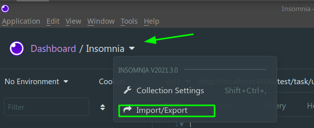
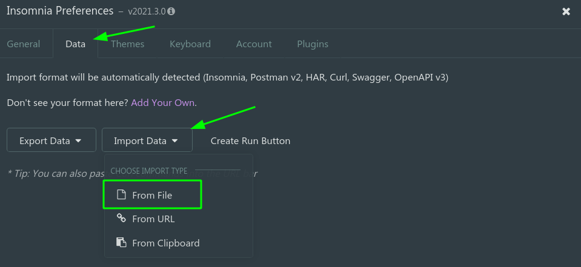
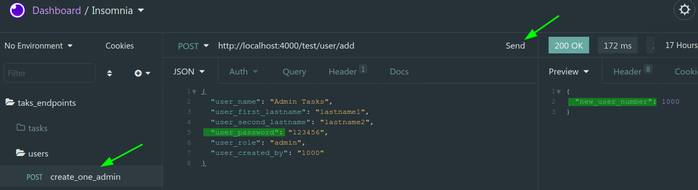

# RUN TASK NOTES API (For developtment environment)

---

## Requirements

+ Nodesjs >= v.14
+ npm 
+ insomnia api tester
+ mysql

---

## Get started database

+ You need a mysql instance with a database `notesdatabase`

<mark>FN:</mark> Only if you need, use the below docker-compose file

```bash
./docker-compose.yml
```

+ You can use the below script `sql` to create tables 

```bash
./dump/1_taskDatabase.sql
```

---

## Get started backend tasks project

+ Into the project ... install the al `npm` packages with ...

```bash
npm install
```

+ You can run `backend` with below script

```bash
npm run dev
```

+ If everything is `ok` you can see the below message

```bash
server running in port -->  4000
Connection to MYSQL-SERVER db success.
```

### Create the first admin user with endpoint

<mark>Warning:</mark> No middle ware for this example project in developtment environment

+ restore all endpoints in `insomnia api rest tester`app

+ use the below `json file`

```bash
./notes_endpoints.json
```





+ Then run `send` below `endpoint`



+ The first account user is: 

`user number:` 1000
`password:` 123456


